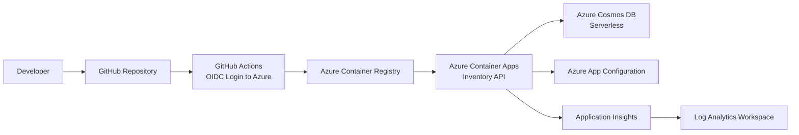

# Inventory API Architecture (High-Level)

## Overview

This repository is structured for a cloud-native Inventory API running on Azure Container Apps.

- The API is implemented using ASP.NET Core Web API.
- Containers are built and stored in Azure Container Registry (ACR).
- Azure Container Apps hosts the Inventory API workload.
- Azure Cosmos DB (Serverless) stores inventory domain data.
- Azure App Configuration stores application configuration.
- Application Insights and Log Analytics provide telemetry and monitoring.

## Security and Identity

- GitHub Actions uses OpenID Connect (OIDC) with `azure/login@v2`.
- No client secrets are used in workflow authentication.
- No connection strings are committed in source control.
- The application is planned to use Managed Identity + `DefaultAzureCredential` for Azure SDK access.
- Terraform placeholders are intentionally non-deploying and ready for RBAC-first implementation.
